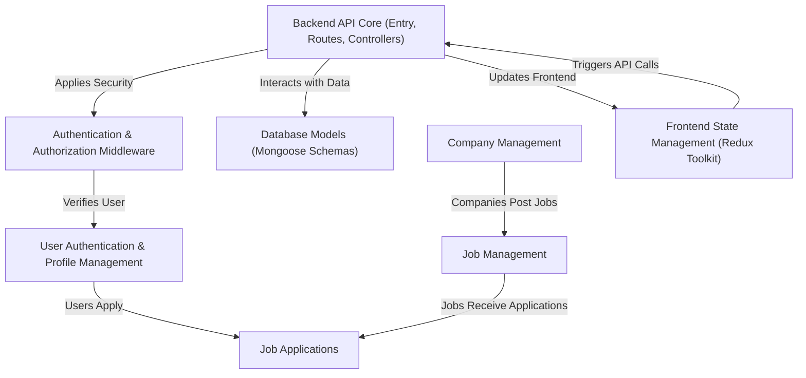

# Tutorial: job-portal

This project is a **job portal** that connects *job seekers* and *recruiters*.
*Job seekers* can browse and apply for available jobs, managing their *profiles*.
*Recruiters* can register *companies*, post new *job listings*, and manage *applications* received for their jobs.
It uses a backend API for logic and data storage, and a frontend with state management for user interaction.

## Visual Overview

## Chapters

1. [User Authentication & Profile Management
](01_user_authentication___profile_management_.md)
2. [Company Management
](02_company_management_.md)
3. [Job Management
](03_job_management_.md)
4. [Job Applications
](04_job_applications_.md)
5. [Database Models (Mongoose Schemas)
](05_database_models__mongoose_schemas__.md)
6. [Backend API Core (Entry, Routes, Controllers)
](06_backend_api_core__entry__routes__controllers__.md)
7. [Authentication & Authorization Middleware
](07_authentication___authorization_middleware_.md)
8. [Frontend State Management (Redux Toolkit)
](08_frontend_state_management__redux_toolkit__.md)

---

Generated by [AI Codebase Knowledge Builder](https://github.com/The-Pocket/Tutorial-Codebase-Knowledge).